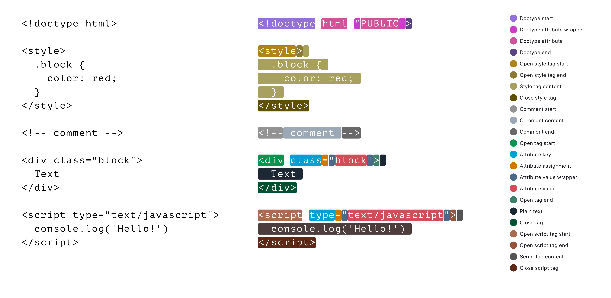

# Hyntax

Simple HTML parser.

__Separate tokenizer and tree-constructor__. 
You can import and use both modules separately or in combination.

__Streaming.__ 
Can process HTML in chunks.

__Zero dependency.__ 
Hyntax is written from scratch as a case-study.

__Both Node.js and browser.__

__Not just a set of RegExp's.__ 
It's a legit [parser](https://en.wikipedia.org/wiki/Parsing).


## Usage

```javascript
const util = require('util')

const { tokenize, constructTree } = require('hyntax')

const inputHTML = `
<html>
  <body>
      <input type="text" placeholder="Don't type"> 
      <button>Don't press</button>
  </body>
</html>
`

const { tokens } = tokenize(inputHTML)
const { ast } = constructTree(tokens)

console.log(JSON.stringify(tokens, null, 2))
console.log(util.inspect(ast, { showHidden: false, depth: null }))
```


## Usage in Browser

You can bundle Hyntax into your front-end application without any problems with Webpack, Rollup or Browserify. 

Single Node.js specific piece of code is the native Node's streams. All mentioned bundlers have a client-side substitute for “stream” module.

All components of Hyntax are separate files, so you can bundle only parts you actually need.

```javascript
import tokenize from 'hyntax/lib/tokenize'
import constructTree from 'hyntax/lib/construct-tree'

import StreamTokenizer from 'hyntax/lib/stream-tokenizer'
import StreamTreeConstructor from 'hyntax/lib/stream-tree-constructor'
```


## Streaming

Stream parsing can be handy in a couple of cases:

* You have a huge HTML and you don't want or can't store it whole in the memory
* You need to generate tokens and AST while HTML is still being loaded

With Hyntax it looks like this

```javascript
const http = require('http')
const util = require('util')

const { StreamTokenizer, StreamTreeConstructor } = require('hyntax')

http.get('http://info.cern.ch', (res) => {
  const streamTokenizer = new StreamTokenizer()
  const streamTreeConstructor = new StreamTreeConstructor()

  let resultTokens = []
  let resultAst

  res.pipe(streamTokenizer).pipe(streamTreeConstructor)

  streamTokenizer
    .on('data', (tokens) => {
      resultTokens = resultTokens.concat(tokens)
    })
    .on('end', () => {
      console.log(JSON.stringify(resultTokens, null, 2))
    })

  streamTreeConstructor
    .on('data', (ast) => {
      resultAst = ast
    })
    .on('end', () => {
      console.log(util.inspect(resultAst, { showHidden: false, depth: null }))
    })
}).on('error', (err) => {
  throw err;
})
```


## Tokenizer

Hyntax has its tokenizer as a separate module. You can use generated tokens on their own or pass them further to a tree costructor to build an AST.

#### Interface

```javascript
tokenize(html<String>, [existingState<Object>], [options<Object>])
```

For most use-cases, single ```html``` argument is sufficient. 

All other arguments are needed only for stream parsing and being used internaly by ```StreamTokenizer```  class. You should worry about those only if you're going to have a custom implementation of stream tokenizer.

#### Arguments

* ```html<String>```

  Required.

  HTML string to process


* ```existingState<Object>```

  Optional.

  When input is coming in chunks and multiple calls of ```tokenize(chunk)``` are required, ```existingState``` parameter is used to pass result of previous call.

  Default value — ```undefined```.

* ```options.isFinalChunk<Boolean>```

  Optional.

  Signal that current input chunk is the last one. Used for creating of the last token which does not have explicit ending. For example when input is interrupted in the middle of a tag content without reaching closing tag.

  Default value — ```true```  

#### Returns

```javascript
tokenize(html) → { state<Object>, tokens<Array> }
```

* ```state<Object>```

  Current state of tokenizer. It can be persist and passed to the next tokenizer call if input is coming in chunks.

* ```tokens<Array>```

  Array of resulting tokens.


## Tokens

Here is a high level overview of all possible tokens.



Each token is an object with several properties

```javascript
{
  type: <String>,
  content: <String>,
  startPosition: <Number>,
  endPosition: <Number>
}
```

* ```type<String>```

  One of the type constants from [lib/constants/token-types.js](https://github.com/nik-garmash/hyntax/blob/master/lib/constants/token-types.js).

* ```content<String>```

  Piece of original HTML input which was recognized as a token.

* ```startPosition<Number>```

  Index of a character in the input HTML string where token starts.

* ```endPosition<Number>```

  Index of a character in the input HTML string where token ends.


## Tree Constructor

After you have an array of tokens, you can pass them into tree constructor to build an AST.

#### Interface

```javascript
constructTree(tokens<Array>, [existingState<Object>])
```

For most use-cases, single ```tokens``` argument is sufficient.

```existingState``` argument is used internaly by ```StreamTreeConstructor``` . You need to worry about it only if you're going to implement custom stream tree constructor.

#### Arguments

- ```tokens<Array>```

  Required.

  Array of tokens recieved from the tokenizer.

- ```existingState<Object>```

  Optional.

  State, returned by previous ```constructTree(tokens)``` call. Makes possible to build AST incrementally in case the tokens come in chunks.

#### Returns

```javascript
constructTree(tokens) → { state<Object>, ast<Object> }
```

- ```state<Object>```

  Current state of the tree constructor. Can be persist and passed to the next tree constructor call in case tokens come in chunks.

- ```ast<Object>```

  Resulting AST.


## AST Format

Hyntax AST is a tree of nested nodes which reflects structure of original HTML.

```javascript
{
  nodeType: <String>,
  content: {
    children: [
      {
      	nodeType: <String>,
        content: {…}
      },
      {
      	nodeType: <String>,
	    content: {
      	  childrent: […]	
      	}
      }
    ]    
  }
}
```

#### Types of Nodes

There are 7 node types:

- Document
- Doctype
- Text
- Tag
- Comment
- Script
- Style

#### Node Object

Each node has the same interface.

```javascript
{
  nodeType: <String>,
  content: <Object>
}
```

- ```nodeType<String>```

  One of the type constants from [lib/constants/ast-nodes.js](https://github.com/nik-garmash/hyntax/blob/master/lib/constants/ast-nodes.js).

- ```content<Object>```

  Object with different set of properties depending on the node type. See nodes descriptions to see content interface for a specific type of node. 

#### Document Node

Root node of the AST.

```javascript
{
  nodeType: <String>,
  content: {
    children: <Array>	  		    
  }
}
```

- ```nodeType<String>```

- ```content.children<Array>```

  Array of child nodes.

#### Doctype Node

```javascript
{
  nodeType: <String>,
  content: {
    start: <Token>,
    attributes: <Array>,
    end: <Token>
  }
}
```

- ```nodeType<String>```

- ```content.start<Token>```

  Original input token of a doctype beginning.

- ```content.attributes<Array>```

  Array of the [attribute objects](#doctype-attribute)

- ```end<Token>```

  Original input token of a doctype ending.

#### Text Node

```javascript
{
  nodeType: <String>,
  content: {
    value: <Token>    
  }
}
```

- ```nodeType<String>```

- ```content.value<Token>```

  Original input token of a text.

